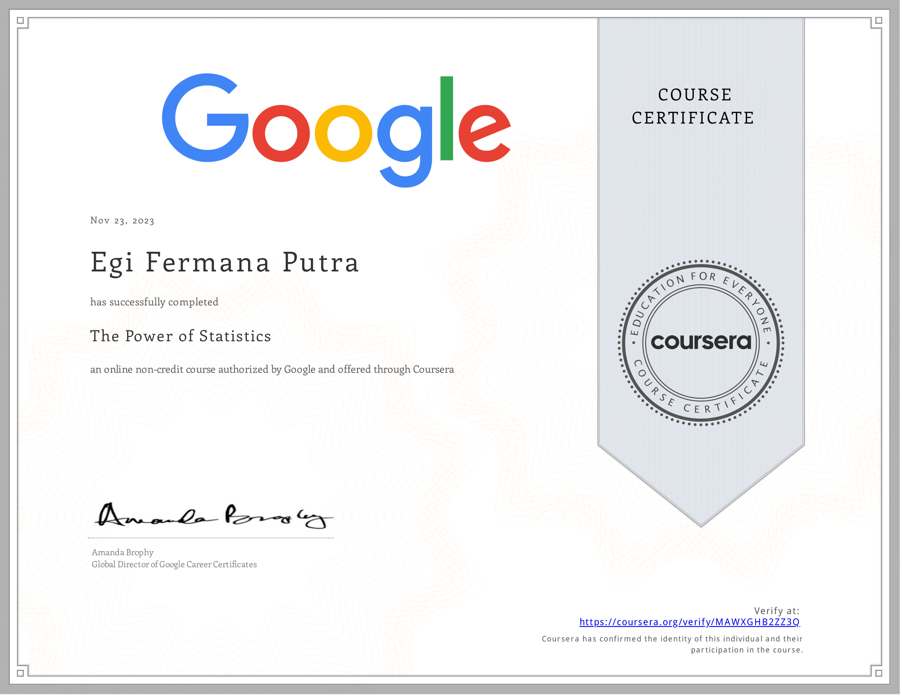

# The Power of Statistics Course by Google

## Overview

This repository showcases my achievements and projects completed during "The Power of Statistics" course offered by Google on Coursera. The course provides a comprehensive understanding of statistical concepts and their practical applications.

## Certificate

**Credential ID:** MAWXGHB2ZZ3Q (Replace with your actual Credential ID)

**Issued by:** Google on Coursera

**Verify the Certificate:** [Verify on Coursera](<insert verification link>)

## Course Content

1. **Module 1: Introduction to Statistics**
   - Basics of Statistics
   - Descriptive Statistics

2. **Module 2: Probability**
   - Probability Basics
   - Probability Distributions

3. **Module 3: Inferential Statistics**
   - Hypothesis Testing
   - Confidence Intervals

4. **Module 4: Regression Analysis**
   - Simple Linear Regression
   - Multiple Linear Regression

5. **Module 5: Analysis of Variance (ANOVA)**
   - Introduction to ANOVA
   - One-Way ANOVA

6. **Module 6: Non-parametric Tests**
   - Introduction to Non-parametric Tests
   - Mann-Whitney U Test

7. **Module 7: Bayesian Statistics**
   - Introduction to Bayesian Statistics
   - Bayesian Inference

## Repository Structure

- Each module has a dedicated folder containing relevant materials, assignments, and projects.
- The `Final_Project` folder showcases the culmination of skills acquired throughout the course.

## Acknowledgments

I extend my gratitude to Google and Coursera for offering this insightful course, providing a solid foundation in statistical concepts and applications.
